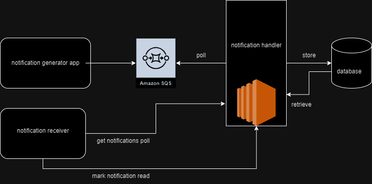

# notification-app
Notification handling app

This is a notification handling application.

It performs following functions
* Poll notifications from notification queue and store in DB
* Provide API to get notifications
* Provide API to mark notifications done

How the overall design span?
Any app who want to create notification must send message to the notification queue. The message needs to contain information about what is the notification and who it is indented for. The apps who wish to retrieve notifications must poll the get-notification API, which will provide all the unread notifications for given target. Once the notification is consumed by client or user, client need to call notification read API to mark it as read.

Why can't we use SQS to get notifications?

SQS has max retention period of 14 days, meaning notification will be deleted from queue after 14 days.

How to avoid DB load because of a lot of read operations?

* A memcached or redis cache can be put in front of database and all the read operations should be sent to this cache.
* Read replicas can be configured for the primary db and all the read call should be made to these read replicas.

API specs:

* Path: /target/{targetId}/notifications
* Method: GET
* Request Parameters
  * status (UNREAD, ALL)
* Response
  * JSON containing list of all the notifications for the given target and status
---
* Path: /notification/{notificationId}/read
* Method: PATCH
* Response
  * Without body with code 200 if successful

Database Table
* notification

| Column | Data Type | Nullable | Default (Value) |
|----|:----:|:----:|:---------------:|
| id (PK) | bigint | No | Auto Generated  |
| source | bigint | Yes |       No        |
| target | bigint | No |       No        |
| message | text | No |       No        |
| status | varchar(10) | No |   Yes(UNREAD)   |
| created_at | timestamp | No |   Yes (now())   |

